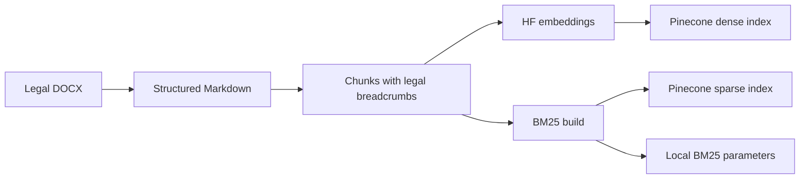
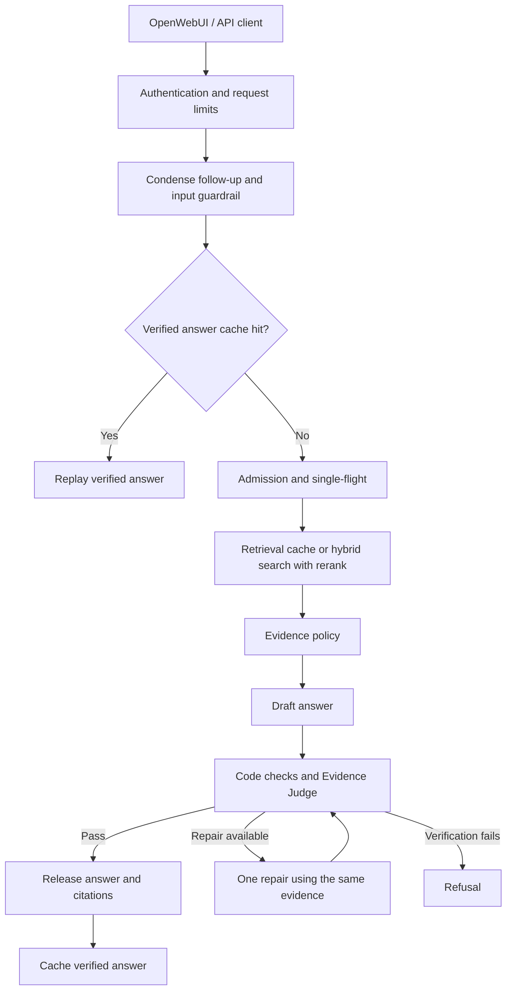
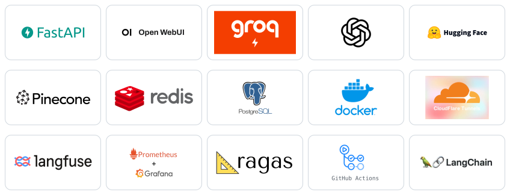
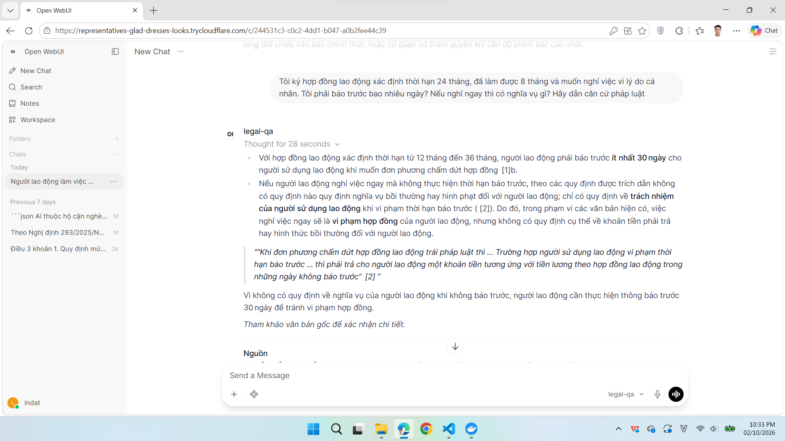
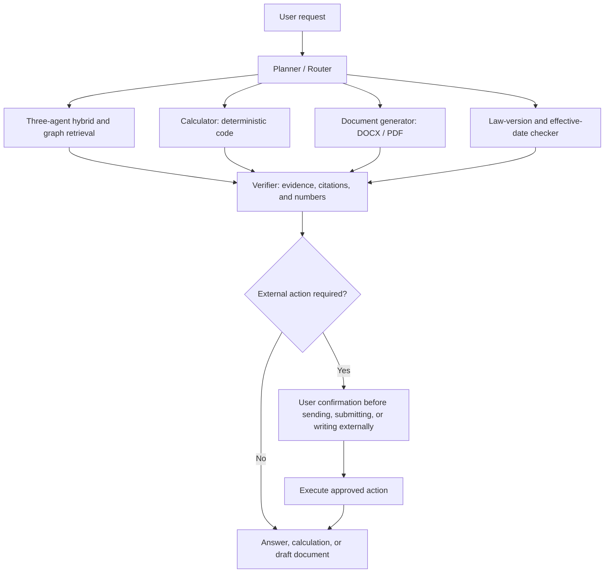

# Production Legal Agentic Graph RAG

Agentic, graph-aware question answering and task execution over Vietnamese legal documents, with citation verification and infrastructure for serving users.

> **Status: early development.** The code currently equals the baseline RAG inherited from [production-legal-qa-rag](https://github.com/lndat18/production-legal-qa-rag) (fresh history, renamed). The agentic and graph capabilities are planned and not yet implemented; see [RAG vs. Agentic Graph RAG](#en-agentic).

## Table of Contents

- [Overview](#en-overview)
- [Key Features &amp; Design Choices](#en-features)
- [Architecture](#en-architecture)
- [Tech Stack](#en-stack)
- [Baseline Evaluation](#en-evaluation)
- [Getting Started](#en-setup)
- [Usage](#en-usage)
- [Operations &amp; Observability](#en-operations)
- [Limitations &amp; Roadmap](#en-roadmap)
- [RAG vs. Agentic Graph RAG (Planned)](#en-agentic)
- [Project Structure](#en-structure)
- [Testing &amp; Code Quality](#en-development)
- [License](#en-license)

<a id="en-overview"></a>

## Overview

- **What:** A Vietnamese legal question-answering chatbot built as a personal project (currently the baseline RAG; agentic and graph extensions are planned), with an OpenAI-compatible API and OpenWebUI chat interface.
- **Problem:** Legal answers depend on exact provisions, conditions, and exceptions. Keyword lookup can miss paraphrases; an LLM answering from memory can produce unsupported claims or citations.
- **Approach:** Retrieval-augmented generation (RAG): preserve legal structure during ingestion, combine semantic and keyword search, then verify answers against retrieved passages before releasing them.
- **Scope:** The included corpus covers labor law, social insurance, health insurance, personal income tax, minimum wages, and labor relations. Answers depend on this corpus and its document versions.
- **Production focus:** Authentication, request limits, bounded concurrency, caching, container deployment, tracing, and metrics. The deployment targets a single host; broader production readiness requires further validation.

<a id="en-features"></a>

## Key Features & Design Choices

| Design choice                                            | Purpose                                                                                                                                                                        |
| -------------------------------------------------------- | ------------------------------------------------------------------------------------------------------------------------------------------------------------------------------ |
| Structure-aware conversion and chunking                  | Preserve document → Article → Clause → Point breadcrumbs and table content so passages remain identifiable.                                                                 |
| Dense + BM25 retrieval with Reciprocal Rank Fusion (RRF) | Combine semantic matches with literal terms and legal identifiers without adding incompatible search scores.                                                                   |
| HyDE alongside the original query                        | Add a hypothetical legal passage as a semantic search branch while retaining the original wording for exact matches.                                                           |
| Citation-aware candidate retrieval                       | Add structural search terms for explicit Article/Clause references before reranking.                                                                                           |
| Local Vietnamese reranker                                | Rank candidates using the original question; run in-process on GPU or CPU.                                                                                                     |
| Code checks + an independent LLM Evidence Judge          | Check citation references, sensitive numbers, supporting evidence, and material conditions before releasing an answer. Allow at most one repair; refuse if verification fails. |
| Conversation handling, Redis cache, and single-flight    | Resolve follow-up questions, reuse verified answers and retrieval results, and coordinate duplicate work.                                                                      |
| Request limits and admission control                     | Bound concurrent LLM work and queue length; apply per-user request limits and handle provider throttling.                                                                      |

These are engineering choices applied to Vietnamese legal QA. Their quality impact is being evaluated; the project does not yet publish measured superiority over a simpler RAG baseline.

<a id="en-architecture"></a>

## Architecture


*Target architecture (planned).* Neo4j knowledge graph, the LangGraph agents (Orchestrator, Searching, Review), MCP, and DeepEval are not implemented yet. The diagrams below describe the current baseline.

**Current baseline, offline ingestion:**



**Current baseline, one chat turn:**



The diagram shows the main path; guardrail rejection, clarification, and service failures can end a turn earlier. Retrieval combines the original query and a best-effort HyDE branch, dense/sparse search, RRF, optional MMR diversity selection, citation candidates, and reranking. Missing or inadequate evidence is handled before drafting. Answer text is buffered until verification passes, including for streaming requests.

Docker Compose runs the API, OpenWebUI, Redis, PostgreSQL, and Cloudflare Tunnel. PostgreSQL serves OpenWebUI; vectors live in Pinecone. A separate observability stack records traces and metrics.

Design details: [retrieval spec](src/production_legal_agentic_graph_rag/retrieval/retrieval_spec.md), [generation spec](src/production_legal_agentic_graph_rag/generation/generation_spec.md), [conversation spec](src/production_legal_agentic_graph_rag/conversation/conversation_spec.md), and [API spec](src/production_legal_agentic_graph_rag/api/api_spec.md).

<a id="en-stack"></a>

## Tech Stack

<p align="center">
  
</p>

| Layer                 | Technology                                                                                                                                              |
| --------------------- | ------------------------------------------------------------------------------------------------------------------------------------------------------- |
| Language and tooling  | Python 3.14, uv, Pydantic v2, Typer                                                                                                                     |
| API and interface     | FastAPI, Uvicorn, OpenAI-compatible chat endpoints, SSE, OpenWebUI                                                                                      |
| LLM inference         | Groq:`openai/gpt-oss-120b` for generation; `openai/gpt-oss-20b` for condense, HyDE, and Judge; `openai/gpt-oss-safeguard-20b` for input guardrail |
| LLM framework         | LangChain (`langchain-openai`, `langchain-text-splitters`)                                                                                              |
| Embeddings            | Hugging Face Inference API,`CODE4LIFEOFFICIAL/huydang-dek21-embedding-v2`, PyVi word segmentation                                                     |
| Retrieval             | Pinecone dense/sparse indexes, BM25, RRF, HyDE, configurable MMR                                                                                        |
| Reranking             | `AITeamVN/Vietnamese_Reranker`, Transformers, PyTorch; local GPU/CPU inference                                                                        |
| State                 | Redis for cache, single-flight, and API request limits; PostgreSQL for OpenWebUI                                                                        |
| Deployment            | Docker Compose, Cloudflare Tunnel                                                                                                                       |
| Observability         | Self-hosted Langfuse, Prometheus, Grafana                                                                                                               |
| Evaluation and checks | RAGAS, pytest, Ruff, mypy, GitHub Actions                                                                                                               |

Model defaults and settings are defined in [config.py](src/production_legal_agentic_graph_rag/config.py).

<a id="en-evaluation"></a>

## Baseline Evaluation (inherited RAG)

The results below were measured on the predecessor RAG system, which this project inherits as its starting point. They are the baseline for comparing future Agentic Graph RAG work, not results of this project. Status of the inherited system as of **October 1, 2026**:

- **Serving:** The ingestion-to-chat pipeline, API, and single-host Docker deployment have been implemented and manually exercised end to end.
- **Observability:** Trace and metrics integration is implemented and has been manually accepted on the production stack.
- **Testset:** The synthetic corpus-derived [golden testset](data/eval/phase1/golden_testset.json) contains **157 retained cases: 142 single-hop and 15 specific multi-hop**, selected after reviewing 203 generated cases. It is not an expert-certified legal benchmark.
- **Evaluation:** Phase 2 has run on all 157 cases with the MMR-off retrieval configuration; results are below. The MMR on/off comparison is close and no winning configuration has been declared. Latency and load have not been benchmarked.
- **Delivery:** CI runs on every PR and push to `main`. Pushing a `vX.Y.Z` tag builds the `api` image (CPU and CUDA 12.6 variants) and publishes it to GHCR; this project has not published a release yet. Deploying to the host stays manual with `./deploy/up.sh --pull vX.Y.Z`.

**Baseline RAGAS results (157-case testset, MMR off, predecessor RAG):**


| Metric            | Mean  | Cases scored | Notes                                                                 |
| ----------------- | :---: | :----------: | --------------------------------------------------------------------- |
| Context Precision | 0.899 | 157          | All 157 cases scored.                                             |
| Context Recall    | 0.866 | 157          | MMR on scored 0.841 vs 0.857 for MMR off overall (13 wins, 11 losses, 133 ties). |
| Faithfulness      | 0.832 | 143          | Only answers that were released; 14 of 157 cases were refused.        |
| Answer Relevancy  | 0.432 | 143          | Same 143 answered cases; this is the weakest metric and is not yet analyzed. |

Counting the 14 refused cases as zero, end-to-end Faithfulness is 0.758 and Answer Relevancy 0.394. About 12% of cases needed one repair. Scores measure agreement with LLM-generated references and an LLM judge from the same model family as the generator, so they do not confirm legal correctness. The multi-hop subset (n=15) should be read as a trend only. Reproduce the chart with `uv run python tools/visualize_eval_metrics.py`.

Evaluation compares MMR on/off using `context_recall`, then evaluates a selected configuration with `faithfulness`, `answer_relevancy`, and `context_precision`. The generation stage reads previously retrieved chunks and runs the serving generation logic: draft → deterministic checks → Evidence Judge, with at most one repair followed by re-verification. It bypasses the API, conversation orchestration, condense, input guardrail, and serving caches. Results are checkpointed by case in JSONL and summarized in `data/eval/phase2/report.json`.

The evaluation path uses a separate dependency group and nine Groq keys:

```bash
uv run --group eval --no-group production python tools/run_eval.py status --testset data/eval/phase1/golden_testset.json
uv run --group eval --no-group production python tools/run_eval.py report --testset data/eval/phase1/golden_testset.json
```

See [evaluation_spec.md, section 11](src/production_legal_agentic_graph_rag/evaluation/evaluation_spec.md) for stage order, configuration selection, resume rules, and quota handling. These measurements cover retrieval and generation; they do not measure the full conversation, cache, or guardrail path.

<a id="en-setup"></a>

## Getting Started

Run commands from the repository root.

**1. Prerequisites**

- Python 3.14 and uv for host tools and data preparation.
- Docker with the Compose plugin and a Bash shell for deployment.
- Groq, Hugging Face, and Pinecone credentials; access to the configured embedding model through Hugging Face inference.
- RAM and disk space for PyTorch, the reranker checkpoint, and containers. The API container has a 3 GiB memory limit; the full deployment needs additional memory, especially with observability.
- Optional: NVIDIA GPU and NVIDIA Container Toolkit. `deploy/up.sh` detects usable GPU support and otherwise builds the CPU variant.

**2. Clone and configure**

```bash
git clone https://github.com/lndat18/production-legal-agentic-graph-rag.git
cd production-legal-agentic-graph-rag
uv sync --frozen
cp .env.example .env
```

Use one root `.env` for the app, deployment, and observability. Fill the following before deploying:

| Group                  | Required settings                                                                                               |
| ---------------------- | --------------------------------------------------------------------------------------------------------------- |
| External services      | `GROQ_API_KEY_1`, `HF_TOKEN`, `PINECONE_API_KEY`, `PINECONE_INDEX_NAME`, `PINECONE_SPARSE_INDEX_NAME` |
| Backend authentication | `CHATBOT_API_KEY`                                                                                             |
| Deployment             | `DEPLOY_POSTGRES_USER`, `DEPLOY_POSTGRES_PASSWORD`, `REDIS_PASSWORD`, `WEBUI_SECRET_KEY`                |

Keep the numeric defaults `RATE_LIMIT_PER_MINUTE=5` and `KEEPALIVE_SECONDS=15`, or set valid numbers. Generate a different secret for each secret field; keep `WEBUI_SECRET_KEY` stable across restarts:

```bash
python3 -c "import secrets; print(secrets.token_urlsafe(32))"
```

Production can use key 1 alone. Optional keys 2–4 separate Judge and generation traffic; evaluation requires keys 1–9. Keep `.env` private. [Detailed configuration reference, in Vietnamese](docs/configuration.md).

**3. Prepare the search indexes**

The repository includes raw documents, Markdown, and chunks. To use the included chunks, build your own cloud indexes and local BM25 parameters:

```bash
uv run python tools/embed_documents.py
uv run python tools/sparse_index_documents.py
```

The tools create missing Pinecone indexes using the configured names. Use two separate indexes dedicated to this project. **These commands replace existing vectors in their target indexes.** Run ingestion offline and check the embedding summary for skipped or failed chunks before proceeding. Dense vectors, sparse vectors, and BM25 parameters must describe the same corpus.

For a new or modified corpus, place DOCX documents in `data/raw/` and first run:

```bash
uv run python tools/format_documents.py
uv run python tools/chunk_documents.py
```

Then rebuild both indexes. Formatting uses Groq; embedding uses Hugging Face. These steps consume provider quota. `data/bm25/bm25_params.json` is generated locally and is required when starting the API. The reranker is downloaded on first use and cached; deployment retains its Hugging Face cache volume.

**4. Start the deployment**

```bash
./deploy/up.sh
```

The default `COMPOSE_PROFILES=quick` creates a Cloudflare quick tunnel; the script prints the public OpenWebUI URL. Create the first account, which becomes the administrator, before sharing that URL. Production services do not publish host ports, so the public URL serves the chat interface rather than a directly exposed backend API.

For a fixed domain, configure `COMPOSE_PROFILES=named`, `TUNNEL_TOKEN`, and `WEBUI_URL` following the [deployment spec](deploy/deploy_spec.md). To record production traces, set up [observability](#en-operations) before starting the deployment.

<a id="en-usage"></a>

## Usage

**Chat interface:** Sign in to OpenWebUI, select `legal-qa`, and ask in Vietnamese. For example:

> Điều 113 Bộ luật Lao động quy định gì về nghỉ hằng năm?

A verified answer includes numbered references such as `[1]` and a source list identifying the document and legal breadcrumb. If retrieved evidence cannot support a verified answer, the system returns a clarification, refusal, or evidence/error message as appropriate. Follow-up questions can use the preceding conversation.



**Local API:** Start a local Redis instance or use an existing one. For a new development instance:

```bash
docker run --detach --name legal-qa-dev-redis \
  --publish 127.0.0.1:6379:6379 redis:7-alpine
```

Set `REDIS_URL=redis://localhost:6379/0` in `.env`, complete the app configuration and indexing steps above, then run:

```bash
uv run uvicorn production_legal_agentic_graph_rag.api.app:create_app \
  --factory --host 127.0.0.1 --port 8000 --workers 1
```

In another Bash terminal, enter the same `CHATBOT_API_KEY` configured in `.env` at the hidden prompt, then call the API:

```bash
read -rsp 'CHATBOT_API_KEY: ' CHATBOT_API_KEY
curl --silent --show-error http://127.0.0.1:8000/v1/chat/completions \
  -H "Authorization: Bearer ${CHATBOT_API_KEY}" \
  -H 'Content-Type: application/json' \
  -H 'X-OpenWebUI-User-Id: local-demo' \
  --data '{"model":"legal-qa","messages":[{"role":"user","content":"Điều 113 Bộ luật Lao động quy định gì về nghỉ hằng năm?"}],"stream":false}'
```

Use `"stream":true` and `curl --no-buffer` for SSE. The API also provides `GET /v1/models`, `/healthz`, and `/readyz`. Readiness checks Redis; it does not verify Groq or Pinecone availability. User identity headers are trusted only after backend key authentication; keep this shared backend key on trusted clients.

<a id="en-operations"></a>

## Operations & Observability

| Task                             | Command / location                                                                              |
| -------------------------------- | ----------------------------------------------------------------------------------------------- |
| Build/start or update deployment | `./deploy/up.sh` (or `./deploy/up.sh --pull vX.Y.Z` to use the prebuilt GHCR image)         |
| Stop deployment, retain volumes  | `./deploy/down.sh`                                                                            |
| Back up OpenWebUI PostgreSQL     | `./deploy/backup.sh` → `deploy/backups/<date>/openwebui.sql.gz`; keeps seven daily backups |
| Clear answer/retrieval cache     | `./deploy/reset_cache.sh`                                                                     |
| Start / stop observability       | `./observability/up.sh` / `./observability/down.sh`                                         |
| Langfuse / Grafana / Prometheus  | `http://localhost:3001` / `http://localhost:3002` / `http://localhost:9092`               |

For initial observability setup, fill the `OBS_*` block in `.env` using its comments, including the required 64-hex-character encryption key. Start `./observability/up.sh`, create a Langfuse project and API keys, and set `LANGFUSE_PUBLIC_KEY` and `LANGFUSE_SECRET_KEY`. Then run `./deploy/up.sh`: it detects the observability network and connects production tracing and metrics. Grafana credentials use `OBS_GRAFANA_ADMIN_USER` and `OBS_GRAFANA_ADMIN_PASSWORD`.

Langfuse is the application's turn-trace store. Turns without working tracing are not recovered later; OpenWebUI separately stores chat history. The PostgreSQL backup command covers OpenWebUI, not the observability stack. OpenWebUI settings saved through the Admin Panel can override Compose defaults on later starts.

See the [configuration reference](docs/configuration.md), [deployment spec](deploy/deploy_spec.md), and [observability spec](src/production_legal_agentic_graph_rag/observability/observability_spec.md) for details.

<a id="en-roadmap"></a>

## Limitations & Roadmap

| Current limitation                     | Implication                                                                                                                                 |
| -------------------------------------- | ------------------------------------------------------------------------------------------------------------------------------------------- |
| Limited corpus and document versions   | The system does not independently establish whether a provision is currently in force or covers a user's full situation.                    |
| LLM-based verification                 | A passing Judge verdict reduces unsupported output but does not prove legal correctness; verification also adds latency and consumes quota. |
| External inference and search services | Groq, Hugging Face, and Pinecone availability and quotas affect serving. Self-hosted traces do not make the inference path fully local.     |
| One API worker on one host             | Admission is in-process; scaling to multiple workers or hosts requires revisiting shared concurrency and resource controls.                 |
| Offline full index rebuilds            | Refreshes are not atomic; interrupted publication can temporarily leave an index incomplete.                                                |
| Quick tunnel and host availability     | The default public URL can change; host shutdown, sleep, or connectivity loss interrupts service.                                           |
| Evaluation scope                       | Quality scores cover the MMR-off configuration on a synthetic testset; there are no latency or load benchmark results, and Answer Relevancy is low and unanalyzed. |

Next steps: analyze the low Answer Relevancy and choose MMR based on further results; use real traces to identify failure cases. Moving observability to another host remains an open design decision.

<a id="en-agentic"></a>

## RAG vs. Agentic Graph RAG (Planned)

This project inherits the baseline RAG's full tech stack and extends retrieval and task execution. **The comparison below describes intended capabilities, not implemented features or measured improvements.**

**Legend:** ✅ = implemented in the baseline RAG, or planned for Agentic Graph RAG; ❌ = no dedicated capability in the current system. Every ✅ in the Agentic Graph RAG column is a future target.

| Capability | RAG | Agentic Graph RAG |
| --- | :---: | :---: |
| Vietnamese legal QA with Article/Clause/Point citations | ✅ | ✅ |
| Hybrid dense + BM25 retrieval, HyDE, RRF, optional MMR, and local reranking | ✅ | ✅ |
| Deterministic answer checks and an independent Evidence Judge | ✅ | ✅ |
| Conversation context, caching, API, chat interface, deployment, and observability | ✅ | ✅ |
| RAG quality evaluation with RAGAS | ✅ | ✅ |
| Three cooperating retrieval agents | ❌ | ✅ |
| Decompose and retrieve for requests spanning multiple Clauses or Articles | ❌ | ✅ |
| Follow legal cross-references through a knowledge graph | ❌ | ✅ |
| Plan → retrieve → call tools → verify → produce task outputs | ❌ | ✅ |
| Calculate personal income tax using a code-based calculator and show a per-bracket breakdown | ❌ | ✅ |
| Draft tax forms and export DOCX/PDF files | ❌ | ✅ |
| Analyze user-uploaded employment contracts or invoices | ❌ | ✅ |
| Scheduled law-change monitoring, alerts, and re-indexing | ❌ | ✅ |
| Check provision applicability by effective date and tax period | ❌ | ✅ |
| Connect tools and data sources through MCP | ❌ | ✅ |
| Evaluate agent tool use and task completion with DeepEval | ❌ | ✅ |

**Retrieval direction.** The current design targets questions answerable at Clause level or below. Clause is the default chunk unit; long Clauses can be split further. Retrieval can return multiple chunks, but it has no agentic query decomposition or graph traversal to systematically assemble evidence across Clauses, Articles, and documents. Its multi-hop test cases do not establish reliable coverage of broader requests.

The proposed retrieval design uses **three cooperating agents**, with roles still to be finalized: a **Retrieval Planner** to split the request into subqueries and identify missing evidence; a **Hybrid Retrieval Agent** to search and rerank passages; and a **Graph Retrieval Agent** to follow cross-references and gather connected provisions. LangGraph would coordinate their shared state and bounded follow-up searches before answer verification. This can be described as a **multi-agent retrieval system** if the components make agent-level decisions and exchange results; three fixed LLM calls alone do not establish that architecture. See [LangChain's multi-agent patterns](https://docs.langchain.com/oss/python/langchain/multi-agent).

**Further idea: personal income tax advisory and execution agent.** Beyond answering questions, the agent would plan, retrieve applicable provisions, calculate, and prepare documents. Proposed functions are automatic salary-tax calculation; drafting tax finalization forms or tax-reduction requests; classifying taxable/exempt income from uploaded documents; multi-step advice covering residency, income type, applicable rules, and calculation; and scheduled monitoring of legal changes.

For example, a request such as “Monthly salary VND 40 million, two young children, social insurance VND 4 million—calculate my tax” would trigger clarification of missing information, retrieval of applicable rules, and a calculator tool. The output would include a per-bracket calculation and legal citations.



The calculator owns arithmetic; the LLM extracts parameters. Legal conclusions require Article/Clause citations, applicability checks must use the relevant date and tax period, and missing information prompts a question. Actions that send, submit, or write to an external system require user confirmation.

**Additional technologies to explore:** [LangGraph](https://docs.langchain.com/oss/python/langgraph/overview) for agent orchestration; [Neo4j](https://neo4j.com/docs/getting-started/graph-database/) for legal relationships and cross-references; [Jev by TypeSafe AI](https://typesafe.ai/) for structured routing decisions, with the goal of lowering routing latency and cost; [MCP](https://modelcontextprotocol.io/docs/getting-started/intro) for tool/data-source integration; and [DeepEval](https://deepeval.com/docs/metrics-tool-correctness) for agent evaluation alongside RAGAS. Jev's routing quality, latency, and cost must be measured on this project's requests before adoption.

Evaluation would compare retrieval recall and evidence completeness on Clause-level, broader, and cross-reference cases, plus tool-call accuracy, task success rate, numeric error against deterministic expected results, latency, and cost. Tax cases would include non-residents, multiple income sources, dependents, and effective-date boundaries.

The proposed tax-agent sequence is: **salary-tax calculator → document generator → multi-step planner and verifier → scheduled law monitoring**. These ideas still need a finalized design and implementation.

<a id="en-structure"></a>

## Project Structure

Main packages, pipeline tools, corpus files, and deployment configuration:

```text
production-legal-agentic-graph-rag/
├── .github/
│   └── workflows/
│       ├── ci.yml                                   # CI checks
│       └── release.yml                              # Build + publish api image to GHCR on vX.Y.Z tag
├── src/
│   └── production_legal_agentic_graph_rag/
│       ├── formatting/                              # DOCX → structured Markdown
│       ├── chunking/                                # Legal structure-aware chunks
│       ├── embedding/                               # Embeddings and dense index publication
│       ├── retrieval/                               # Hybrid search and local reranking
│       ├── generation/                              # Draft, verification, and repair
│       ├── conversation/                            # Turn orchestration and admission
│       ├── cache/                                   # Redis cache and single-flight
│       ├── api/                                     # OpenAI-compatible FastAPI backend
│       ├── observability/                           # Application tracing and metrics
│       ├── evaluation/                              # Testset generation and RAGAS evaluation
│       └── config.py                                # Shared application settings
├── tools/
│   ├── format_documents.py
│   ├── chunk_documents.py
│   ├── embed_documents.py
│   ├── sparse_index_documents.py
│   ├── retrieval.py
│   ├── generation.py
│   ├── conversation.py
│   ├── cache.py
│   ├── api_smoke_test.py
│   ├── generate_testset.py
│   └── run_eval.py
├── tests/                                           # Unit, integration, and acceptance tests
├── data/
│   ├── raw/                                         # Source DOCX documents
│   ├── markdown/                                    # Structured documents
│   ├── chunks/                                      # Chunk JSON files
│   ├── embeddings/                                  # Corpus embedding checkpoints
│   └── eval/
│       ├── units/                                  # Source units for testset generation
│       ├── units_plan.md                           # Unit generation plan
│       ├── phase1/                                 # Testset generation artifacts and checkpoints
│       │   ├── golden_testset.json                 # Final evaluation testset
│       │   └── golden_testset_review.json          # Sample review decisions
│       └── phase2/                                 # Evaluation stage checkpoints and reports
├── deploy/
│   ├── Dockerfile
│   ├── docker-compose.yml                           # End-user services
│   ├── docker-compose.gpu.yml                       # GPU override
│   ├── docker-compose.observe.yml                   # Observability connection
│   ├── up.sh
│   ├── down.sh
│   ├── backup.sh
│   ├── reset_cache.sh
│   └── deploy_spec.md
├── observability/
│   ├── docker-compose.yml                           # Langfuse, Prometheus, Grafana
│   ├── prometheus.yml
│   ├── grafana/                                     # Grafana provisioning
│   ├── up.sh
│   └── down.sh
├── docs/
│   ├── configuration.md                             # Configuration reference
│   ├── architecture.png
│   ├── demo.png
│   └── techstack/                                  # Technology logos
├── .env.example                                     # Environment template
├── .dockerignore
├── .gitignore
├── pyproject.toml                                   # Dependencies and tool configuration
├── uv.lock                                          # Dependency lockfile
├── README.md
└── LICENSE
```

Each business package contains its `<package>_spec.md` alongside the implementation.

<a id="en-development"></a>

## Testing & Code Quality

Read the relevant `<package>_spec.md` before changing a package. Run the standard checks:

```bash
uv sync --frozen
uv run pytest -m "not slow"
uv run ruff check .
uv run ruff format --check .
uv run mypy src
```

Tests that load real models are marked `slow`; run them with `uv run pytest` when needed. RAGAS-dependent tests need the evaluation environment and can be skipped in the default environment:

```bash
uv run --group eval --no-group production pytest -m "not slow"
```

The `production` and `eval` dependency groups conflict by design; select the appropriate environment rather than installing all groups together. [CI workflow](.github/workflows/ci.yml).

<a id="en-license"></a>

## License

Project code is released under the [MIT License](LICENSE). Third-party models, services, and source documents remain subject to their respective licenses and terms.
