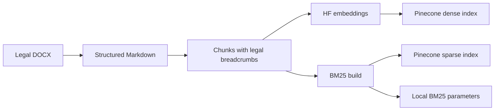
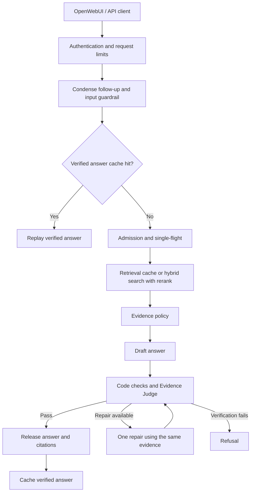
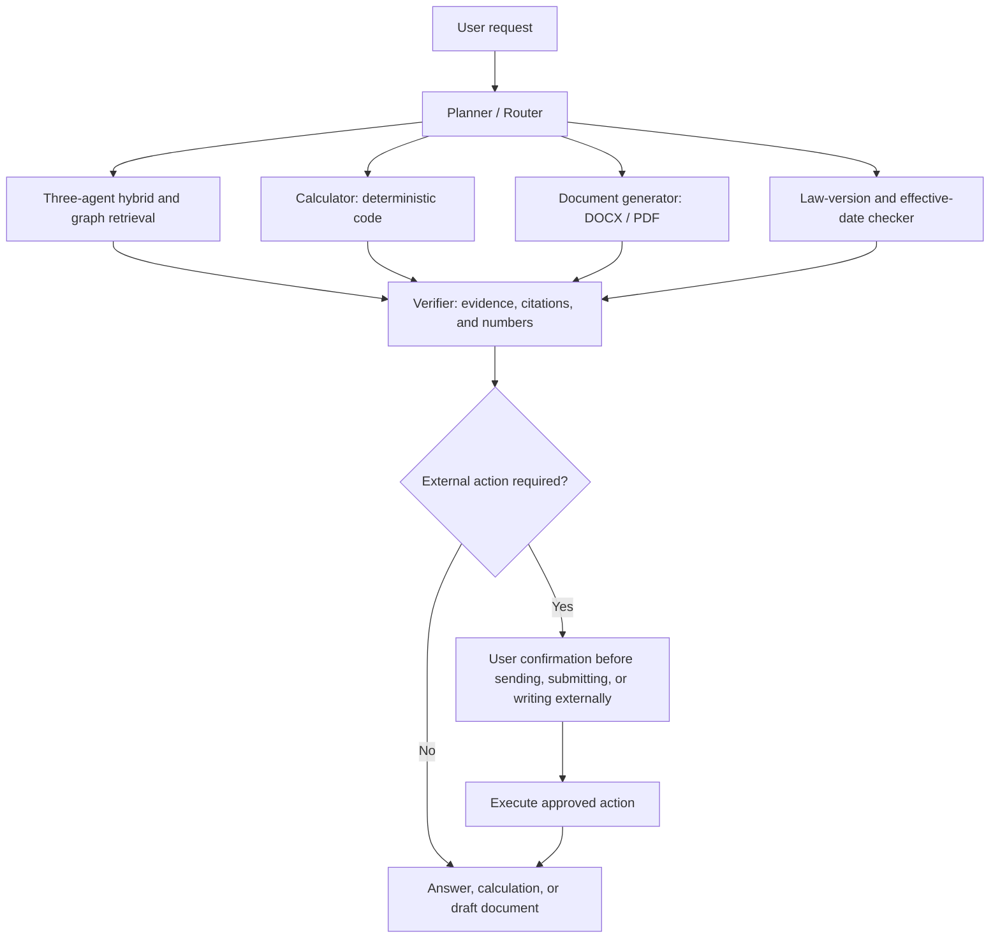

# Production Legal Agentic Graph RAG

- Agentic, graph-aware question answering and task execution over Vietnamese legal documents, with citation verification and infrastructure for serving users.

> **Status: early development.** The code currently equals the baseline RAG inherited from [production-legal-qa-rag](https://github.com/lndat18/production-legal-qa-rag) (fresh history, renamed). The agentic and graph capabilities are planned and not yet implemented; see [RAG vs. Agentic Graph RAG](#en-agentic).

## Table of Contents

- [Overview](#en-overview)
- [Key Features &amp; Design Choices](#en-features)
- [Architecture](#en-architecture)
- [Tech Stack](#en-stack)
- [Baseline Evaluation](#en-evaluation)
- [Getting Started](#en-setup)
- [Usage](#en-usage)
- [Operations &amp; Observability](#en-operations)
- [Limitations &amp; Roadmap](#en-roadmap)
- [RAG vs. Agentic Graph RAG (Planned)](#en-agentic)
- [Project Structure](#en-structure)
- [Testing &amp; Code Quality](#en-development)
- [License](#en-license)

<a id="en-overview"></a>

## Overview

- **What:** Vietnamese legal Q&A chatbot, personal project; OpenAI-compatible API + OpenWebUI chat interface. Currently the baseline RAG; agentic and graph extensions are planned.
- **Problem:** legal answers depend on exact provisions, conditions, and exceptions.
  - Keyword lookup misses paraphrases.
  - An LLM answering from memory can produce unsupported claims or citations.
- **Approach:** retrieval-augmented generation (RAG).
  - Preserve legal structure during ingestion.
  - Combine semantic and keyword search.
  - Verify answers against retrieved passages before release.
- **Scope:** included corpus covers labor law, social insurance, health insurance, personal income tax, minimum wages, labor relations. Answers depend on this corpus and its document versions.
- **Production focus:** authentication, request limits, bounded concurrency, caching, container deployment, tracing, metrics.
  - Targets a single host; broader production readiness needs further validation.

<a id="en-features"></a>

## Key Features & Design Choices

- **Structure-aware conversion and chunking:** keep Document → Article → Clause → Point breadcrumbs and table content so passages stay identifiable.
- **Dense + BM25 retrieval with Reciprocal Rank Fusion (RRF):** combine semantic matches with literal terms and legal identifiers without mixing incompatible scores.
- **HyDE alongside the original query:** hypothetical legal passage as an extra semantic branch; original wording kept for exact matches.
- **Citation-aware candidate retrieval:** structural search terms for explicit Article/Clause references before reranking.
- **Local Vietnamese reranker:** ranks candidates against the original question; runs in-process on GPU or CPU.
- **Code checks + independent LLM Evidence Judge:** verify citation references, sensitive numbers, supporting evidence, material conditions before release; at most one repair; refuse if verification fails.
- **Conversation handling, Redis cache, single-flight:** resolve follow-ups, reuse verified answers and retrieval results, coordinate duplicate work.
- **Request limits and admission control:** bound concurrent LLM work and queue length; per-user limits; handle provider throttling.
- Quality impact is still being evaluated; no measured superiority over a simpler RAG baseline is published yet.

<a id="en-architecture"></a>

## Architecture


*Target architecture (planned).* Neo4j knowledge graph, LangGraph agents (Orchestrator, Searching, Review), MCP, and DeepEval are not implemented yet. The diagrams below describe the current baseline.

**Current baseline, offline ingestion:**



**Current baseline, one chat turn:**



- The diagram shows the main path; guardrail rejection, clarification, and service failures can end a turn earlier.
- Retrieval combines: original query + best-effort HyDE branch, dense/sparse search, RRF, optional MMR diversity selection, citation candidates, reranking.
- Missing or inadequate evidence is handled before drafting.
- Answer text is buffered until verification passes, including for streaming requests.
- Docker Compose runs API, OpenWebUI, Redis, PostgreSQL, Cloudflare Tunnel; PostgreSQL serves OpenWebUI; vectors live in Pinecone.
- A separate observability stack records traces and metrics.
- Design details: [retrieval spec](src/production_legal_agentic_graph_rag/retrieval/retrieval_spec.md), [generation spec](src/production_legal_agentic_graph_rag/generation/generation_spec.md), [conversation spec](src/production_legal_agentic_graph_rag/conversation/conversation_spec.md), [API spec](src/production_legal_agentic_graph_rag/api/api_spec.md).

<a id="en-stack"></a>

## Tech Stack

<p align="center">
  
</p>

- **Language and tooling:** Python 3.14, uv, Pydantic v2, Typer.
- **API and interface:** FastAPI, Uvicorn, OpenAI-compatible chat endpoints, SSE, OpenWebUI.
- **LLM inference (Groq):**
  - `openai/gpt-oss-120b`: generation
  - `openai/gpt-oss-20b`: condense, HyDE, Judge
  - `openai/gpt-oss-safeguard-20b`: input guardrail
- **LLM framework:** LangChain (`langchain-openai`, `langchain-text-splitters`).
- **Embeddings:** Hugging Face Inference API, `CODE4LIFEOFFICIAL/huydang-dek21-embedding-v2`, PyVi word segmentation.
- **Retrieval:** Pinecone dense/sparse indexes, BM25, RRF, HyDE, configurable MMR.
- **Reranking:** `AITeamVN/Vietnamese_Reranker`, Transformers, PyTorch; local GPU/CPU inference.
- **State:** Redis (cache, single-flight, API request limits); PostgreSQL (OpenWebUI).
- **Deployment:** Docker Compose, Cloudflare Tunnel.
- **Observability:** self-hosted Langfuse, Prometheus, Grafana.
- **Evaluation and checks:** RAGAS, pytest, Ruff, mypy, GitHub Actions.
- Model defaults and settings: [config.py](src/production_legal_agentic_graph_rag/config.py).

<a id="en-evaluation"></a>

## Baseline Evaluation (inherited RAG)

- Results below were measured on the predecessor RAG system; they are the baseline for comparing future Agentic Graph RAG work, not results of this project.
- Status of the inherited system as of **October 1, 2026**:
  - **Serving:** ingestion-to-chat pipeline, API, single-host Docker deployment implemented and manually exercised end to end.
  - **Observability:** trace and metrics integration implemented and manually accepted on the production stack.
  - **Testset:** synthetic, corpus-derived [golden testset](data/eval/phase1/golden_testset.json): **157 retained cases (142 single-hop, 15 specific multi-hop)**, selected from 203 generated; not an expert-certified legal benchmark.
  - **Evaluation:** Phase 2 ran on all 157 cases with MMR off; MMR on/off is close and no winner is declared; latency and load not benchmarked.
  - **Delivery:** CI runs on every PR and push to `main`; pushing a `vX.Y.Z` tag builds the `api` image (CPU and CUDA 12.6) and publishes to GHCR; this project has not published a release yet; host deploy stays manual: `./deploy/up.sh --pull vX.Y.Z`.

**Baseline RAGAS results (157 cases, MMR off, predecessor RAG):**


- **Context Precision: 0.899**, 157 cases scored.
- **Context Recall: 0.866**, 157 cases scored; MMR on scored 0.841 vs 0.857 for MMR off overall (13 wins, 11 losses, 133 ties).
- **Faithfulness: 0.832**, 143 cases scored; only released answers (14 of 157 cases were refused).
- **Answer Relevancy: 0.432**, same 143 cases; weakest metric, not yet analyzed.
- Counting the 14 refused cases as zero: end-to-end Faithfulness 0.758, Answer Relevancy 0.394; about 12% of cases needed one repair.
- Caveats:
  - Scores measure agreement with LLM-generated references and an LLM judge from the generator's model family; they do not confirm legal correctness.
  - Multi-hop subset (n=15) is a trend only.
- Reproduce the chart: `uv run python tools/visualize_eval_metrics.py`.

**Method**

- Compare MMR on/off with `context_recall`, then evaluate the selected configuration with `faithfulness`, `answer_relevancy`, `context_precision`.
- Generation stage reads previously retrieved chunks and runs the serving generation logic: draft → deterministic checks → Evidence Judge, at most one repair then re-verification.
- It bypasses the API, conversation orchestration, condense, input guardrail, and serving caches; so it does not measure the full conversation, cache, or guardrail path.
- Results are checkpointed by case in JSONL and summarized in `data/eval/phase2/report.json`.
- Separate dependency group and nine Groq keys:

```bash
uv run --group eval --no-group production python tools/run_eval.py status --testset data/eval/phase1/golden_testset.json
uv run --group eval --no-group production python tools/run_eval.py report --testset data/eval/phase1/golden_testset.json
```

- Stage order, configuration selection, resume rules, quota handling: [evaluation_spec.md, section 11](src/production_legal_agentic_graph_rag/evaluation/evaluation_spec.md).

<a id="en-setup"></a>

## Getting Started

- Run commands from the repository root.

**1. Prerequisites**

- Python 3.14 and uv (host tools, data preparation).
- Docker with the Compose plugin and a Bash shell (deployment).
- Groq, Hugging Face, Pinecone credentials; access to the configured embedding model via Hugging Face inference.
- RAM and disk for PyTorch, the reranker checkpoint, containers; the API container has a 3 GiB memory limit; full deployment needs more, especially with observability.
- Optional: NVIDIA GPU + NVIDIA Container Toolkit; `deploy/up.sh` detects usable GPU support, otherwise builds the CPU variant.

**2. Clone and configure**

```bash
git clone https://github.com/lndat18/production-legal-agentic-graph-rag.git
cd production-legal-agentic-graph-rag
uv sync --frozen
cp .env.example .env
```

- One root `.env` for app, deployment, and observability. Fill before deploying:
  - External services: `GROQ_API_KEY_1`, `HF_TOKEN`, `PINECONE_API_KEY`, `PINECONE_INDEX_NAME`, `PINECONE_SPARSE_INDEX_NAME`
  - Backend authentication: `CHATBOT_API_KEY`
  - Deployment: `DEPLOY_POSTGRES_USER`, `DEPLOY_POSTGRES_PASSWORD`, `REDIS_PASSWORD`, `WEBUI_SECRET_KEY`
- Keep numeric defaults `RATE_LIMIT_PER_MINUTE=5` and `KEEPALIVE_SECONDS=15`, or set valid numbers.
- Generate a different secret per secret field; keep `WEBUI_SECRET_KEY` stable across restarts:

```bash
python3 -c "import secrets; print(secrets.token_urlsafe(32))"
```

- Production can use key 1 alone; optional keys 2–4 separate Judge and generation traffic; evaluation requires keys 1–9.
- Keep `.env` private. [Detailed configuration reference (Vietnamese)](docs/configuration.md).

**3. Prepare the search indexes**

- Repository includes raw documents, Markdown, and chunks. To use the included chunks, build your own cloud indexes and local BM25 parameters:

```bash
uv run python tools/embed_documents.py
uv run python tools/sparse_index_documents.py
```

- Tools create missing Pinecone indexes using the configured names; use two indexes dedicated to this project.
- **These commands replace existing vectors in their target indexes.**
- Run ingestion offline; check the embedding summary for skipped or failed chunks first.
- Dense vectors, sparse vectors, and BM25 parameters must describe the same corpus.
- New or modified corpus: put DOCX files in `data/raw/`, run the two commands below, then rebuild both indexes:

```bash
uv run python tools/format_documents.py
uv run python tools/chunk_documents.py
```

- Formatting uses Groq; embedding uses Hugging Face; both consume provider quota.
- `data/bm25/bm25_params.json` is generated locally and required to start the API.
- Reranker downloads on first use and is cached; deployment keeps its Hugging Face cache volume.

**4. Start the deployment**

```bash
./deploy/up.sh
```

- Default `COMPOSE_PROFILES=quick` creates a Cloudflare quick tunnel; the script prints the public OpenWebUI URL.
- Create the first account (it becomes administrator) before sharing the URL.
- Production services publish no host ports; the public URL serves the chat interface, not a directly exposed backend API.
- Fixed domain: set `COMPOSE_PROFILES=named`, `TUNNEL_TOKEN`, `WEBUI_URL` per the [deployment spec](deploy/deploy_spec.md).
- To record production traces, set up [observability](#en-operations) before starting the deployment.

<a id="en-usage"></a>

## Usage

**Chat interface**

- Sign in to OpenWebUI, select `legal-qa`, ask in Vietnamese, e.g.:

> Điều 113 Bộ luật Lao động quy định gì về nghỉ hằng năm?

- Verified answer: numbered references such as `[1]` plus a source list (document + legal breadcrumb).
- Evidence cannot support a verified answer: clarification, refusal, or evidence/error message.
- Follow-up questions can use the preceding conversation.


**Local API**

- Start a local Redis or use an existing one; new development instance:

```bash
docker run --detach --name legal-qa-dev-redis \
  --publish 127.0.0.1:6379:6379 redis:7-alpine
```

- Set `REDIS_URL=redis://localhost:6379/0` in `.env`, finish app configuration and indexing, then run:

```bash
uv run uvicorn production_legal_agentic_graph_rag.api.app:create_app \
  --factory --host 127.0.0.1 --port 8000 --workers 1
```

- In another Bash terminal, enter the same `CHATBOT_API_KEY` from `.env` at the hidden prompt, then call the API:

```bash
read -rsp 'CHATBOT_API_KEY: ' CHATBOT_API_KEY
curl --silent --show-error http://127.0.0.1:8000/v1/chat/completions \
  -H "Authorization: Bearer ${CHATBOT_API_KEY}" \
  -H 'Content-Type: application/json' \
  -H 'X-OpenWebUI-User-Id: local-demo' \
  --data '{"model":"legal-qa","messages":[{"role":"user","content":"Điều 113 Bộ luật Lao động quy định gì về nghỉ hằng năm?"}],"stream":false}'
```

- SSE: `"stream":true` and `curl --no-buffer`.
- Other endpoints: `GET /v1/models`, `/healthz`, `/readyz`; readiness checks Redis only, not Groq or Pinecone.
- User identity headers are trusted only after backend key authentication; keep the shared backend key on trusted clients.

<a id="en-operations"></a>

## Operations & Observability

- Build/start or update deployment: `./deploy/up.sh` (or `./deploy/up.sh --pull vX.Y.Z` for the prebuilt GHCR image).
- Stop deployment, keep volumes: `./deploy/down.sh`.
- Back up OpenWebUI PostgreSQL: `./deploy/backup.sh` → `deploy/backups/<date>/openwebui.sql.gz`; keeps seven daily backups.
- Clear answer/retrieval cache: `./deploy/reset_cache.sh`.
- Start / stop observability: `./observability/up.sh` / `./observability/down.sh`.
- Langfuse / Grafana / Prometheus: `http://localhost:3001` / `http://localhost:3002` / `http://localhost:9092`.
- Initial observability setup:
  - Fill the `OBS_*` block in `.env` (follow its comments), including the required 64-hex-character encryption key.
  - Run `./observability/up.sh`; create a Langfuse project and API keys; set `LANGFUSE_PUBLIC_KEY` and `LANGFUSE_SECRET_KEY`.
  - Run `./deploy/up.sh`: it detects the observability network and connects production tracing and metrics.
  - Grafana credentials: `OBS_GRAFANA_ADMIN_USER`, `OBS_GRAFANA_ADMIN_PASSWORD`.
- Notes:
  - Langfuse is the turn-trace store; turns without working tracing are not recovered later; OpenWebUI stores chat history separately.
  - The PostgreSQL backup covers OpenWebUI, not the observability stack.
  - OpenWebUI settings saved in the Admin Panel can override Compose defaults on later starts.
- Details: [configuration reference](docs/configuration.md), [deployment spec](deploy/deploy_spec.md), [observability spec](src/production_legal_agentic_graph_rag/observability/observability_spec.md).

<a id="en-roadmap"></a>

## Limitations & Roadmap

- **Limited corpus and document versions:** the system does not establish whether a provision is currently in force or covers a user's full situation.
- **LLM-based verification:** a passing Judge verdict reduces unsupported output but does not prove legal correctness; it also adds latency and consumes quota.
- **External inference and search services:** Groq, Hugging Face, Pinecone availability and quotas affect serving; self-hosted traces do not make the inference path local.
- **One API worker on one host:** admission is in-process; multiple workers/hosts need shared concurrency and resource controls.
- **Offline full index rebuilds:** refreshes are not atomic; an interrupted publication can leave an index incomplete.
- **Quick tunnel and host availability:** default public URL can change; host shutdown, sleep, or connectivity loss interrupts service.
- **Evaluation scope:** scores cover MMR-off on a synthetic testset; no latency/load benchmark; Answer Relevancy is low and unanalyzed.
- Next steps:
  - Analyze the low Answer Relevancy; choose MMR from further results.
  - Use real traces to find failure cases.
  - Moving observability to another host: open design decision.

<a id="en-agentic"></a>

## RAG vs. Agentic Graph RAG (Planned)

- This project inherits the baseline RAG's full tech stack and extends retrieval and task execution.
- **Everything marked planned below is intended capability, not implemented and not measured.**

**Baseline RAG (implemented)**

- Vietnamese legal QA with Article/Clause/Point citations.
- Hybrid dense + BM25 retrieval, HyDE, RRF, optional MMR, local reranking.
- Deterministic answer checks and an independent Evidence Judge.
- Conversation context, caching, API, chat interface, deployment, observability.
- RAG quality evaluation with RAGAS.

**Agentic Graph RAG (planned)**

- Three cooperating retrieval agents.
- Decompose and retrieve for requests spanning multiple Clauses or Articles.
- Follow legal cross-references through a knowledge graph.
- Plan → retrieve → call tools → verify → produce task outputs.
- Calculate personal income tax with a code-based calculator, per-bracket breakdown.
- Draft tax forms; export DOCX/PDF.
- Analyze user-uploaded employment contracts or invoices.
- Scheduled law-change monitoring, alerts, re-indexing.
- Check provision applicability by effective date and tax period.
- Connect tools and data sources through MCP.
- Evaluate agent tool use and task completion with DeepEval.

**Retrieval direction**

- Current design targets questions answerable at Clause level or below; Clause is the default chunk unit; long Clauses can be split.
- Retrieval can return multiple chunks, but has no agentic query decomposition or graph traversal to assemble evidence across Clauses, Articles, documents.
- Its multi-hop test cases do not establish reliable coverage of broader requests.
- Proposed: **three cooperating agents** (roles to be finalized):
  - **Retrieval Planner:** split the request into subqueries; identify missing evidence.
  - **Hybrid Retrieval Agent:** search and rerank passages.
  - **Graph Retrieval Agent:** follow cross-references; gather connected provisions.
- LangGraph would coordinate shared state and bounded follow-up searches before answer verification.
- "Multi-agent retrieval" applies only if components make agent-level decisions and exchange results; three fixed LLM calls do not qualify. See [LangChain multi-agent patterns](https://docs.langchain.com/oss/python/langchain/multi-agent).

**Further idea: personal income tax advisory and execution agent**

- Beyond answering: plan, retrieve applicable provisions, calculate, prepare documents.
- Proposed functions:
  - automatic salary-tax calculation
  - drafting tax finalization forms or tax-reduction requests
  - classifying taxable/exempt income from uploaded documents
  - multi-step advice (residency, income type, applicable rules, calculation)
  - scheduled monitoring of legal changes
- Example: "Monthly salary VND 40 million, two young children, social insurance VND 4 million—calculate my tax" → clarify missing information, retrieve applicable rules, call the calculator; output a per-bracket calculation with legal citations.



- Rules:
  - Calculator owns arithmetic; the LLM extracts parameters.
  - Legal conclusions require Article/Clause citations.
  - Applicability checks use the relevant date and tax period.
  - Missing information prompts a question.
  - Sending, submitting, or writing to an external system requires user confirmation.
- Technologies to explore:
  - [LangGraph](https://docs.langchain.com/oss/python/langgraph/overview): agent orchestration
  - [Neo4j](https://neo4j.com/docs/getting-started/graph-database/): legal relationships and cross-references
  - [Jev by TypeSafe AI](https://typesafe.ai/): structured routing decisions to lower latency/cost; measure routing quality, latency, cost on this project's requests before adopting
  - [MCP](https://modelcontextprotocol.io/docs/getting-started/intro): tool/data-source integration
  - [DeepEval](https://deepeval.com/docs/metrics-tool-correctness): agent evaluation alongside RAGAS
- Evaluation would compare:
  - retrieval recall and evidence completeness on Clause-level, broader, and cross-reference cases
  - tool-call accuracy, task success rate, numeric error vs deterministic expected results, latency, cost
  - tax cases: non-residents, multiple income sources, dependents, effective-date boundaries
- Proposed tax-agent sequence: **salary-tax calculator → document generator → multi-step planner and verifier → scheduled law monitoring**.
- These ideas still need a finalized design and implementation.

<a id="en-structure"></a>

## Project Structure

- Main packages, pipeline tools, corpus files, deployment configuration:

```text
production-legal-agentic-graph-rag/
├── .claude/                                         # Claude Code: agents, skills, settings
├── .github/
│   └── workflows/
│       ├── ci.yml                                   # CI checks
│       └── release.yml                              # Build + publish api image to GHCR on vX.Y.Z tag
├── src/
│   └── production_legal_agentic_graph_rag/
│       ├── formatting/                              # DOCX → structured Markdown
│       ├── chunking/                                # Legal structure-aware chunks
│       ├── embedding/                               # Embeddings and dense index publication
│       ├── retrieval/                               # Hybrid search and local reranking
│       ├── generation/                              # Draft, verification, and repair
│       ├── conversation/                            # Turn orchestration and admission
│       ├── cache/                                   # Redis cache and single-flight
│       ├── api/                                     # OpenAI-compatible FastAPI backend
│       ├── observability/                           # Application tracing and metrics
│       ├── evaluation/                              # Testset generation and RAGAS evaluation
│       └── config.py                                # Shared application settings
├── tools/
│   ├── format_documents.py
│   ├── chunk_documents.py
│   ├── embed_documents.py
│   ├── sparse_index_documents.py
│   ├── retrieval.py
│   ├── generation.py
│   ├── conversation.py
│   ├── cache.py
│   ├── api_smoke_test.py
│   ├── generate_testset.py
│   └── run_eval.py
├── tests/                                           # Unit, integration, and acceptance tests
├── data/
│   ├── raw/                                         # Source DOCX documents
│   ├── markdown/                                    # Structured documents
│   ├── chunks/                                      # Chunk JSON files
│   ├── embeddings/                                  # Corpus embedding checkpoints
│   └── eval/
│       ├── units/                                  # Source units for testset generation
│       ├── units_plan.md                           # Unit generation plan
│       ├── phase1/                                 # Testset generation artifacts and checkpoints
│       │   ├── golden_testset.json                 # Final evaluation testset
│       │   └── golden_testset_review.json          # Sample review decisions
│       └── phase2/                                 # Evaluation stage checkpoints and reports
├── deploy/
│   ├── Dockerfile
│   ├── docker-compose.yml                           # End-user services
│   ├── docker-compose.gpu.yml                       # GPU override
│   ├── docker-compose.observe.yml                   # Observability connection
│   ├── up.sh
│   ├── down.sh
│   ├── backup.sh
│   ├── reset_cache.sh
│   └── deploy_spec.md
├── observability/
│   ├── docker-compose.yml                           # Langfuse, Prometheus, Grafana
│   ├── prometheus.yml
│   ├── grafana/                                     # Grafana provisioning
│   ├── up.sh
│   └── down.sh
├── docs/
│   ├── configuration.md                             # Configuration reference
│   ├── baseline_history.md                          # Inherited baseline progress log
│   ├── architecture.png
│   ├── demo.png
│   └── techstack/                                  # Technology logos
├── .env.example                                     # Environment template
├── .dockerignore
├── .gitignore
├── CLAUDE.md                                        # Project instructions for Claude Code
├── pyproject.toml                                   # Dependencies and tool configuration
├── uv.lock                                          # Dependency lockfile
├── README.md
└── LICENSE
```

- Each business package keeps its `<package>_spec.md` next to the implementation.

<a id="en-development"></a>

## Testing & Code Quality

- Read the relevant `<package>_spec.md` before changing a package. Standard checks:

```bash
uv sync --frozen
uv run pytest -m "not slow"
uv run ruff check .
uv run ruff format --check .
uv run mypy src
```

- Tests that load real models are marked `slow`; run them with `uv run pytest` when needed.
- RAGAS-dependent tests need the evaluation environment and may be skipped in the default one:

```bash
uv run --group eval --no-group production pytest -m "not slow"
```

- `production` and `eval` dependency groups conflict by design; pick one environment, do not install all groups together.
- [CI workflow](.github/workflows/ci.yml).

<a id="en-license"></a>

## License

- Project code: [MIT License](LICENSE).
- Third-party models, services, and source documents remain under their own licenses and terms.
